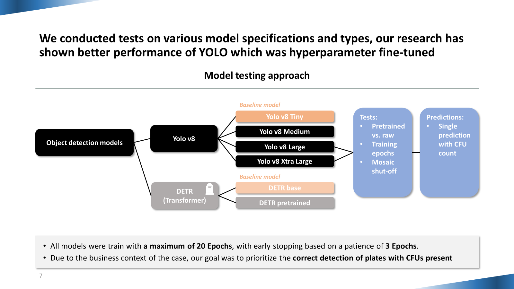
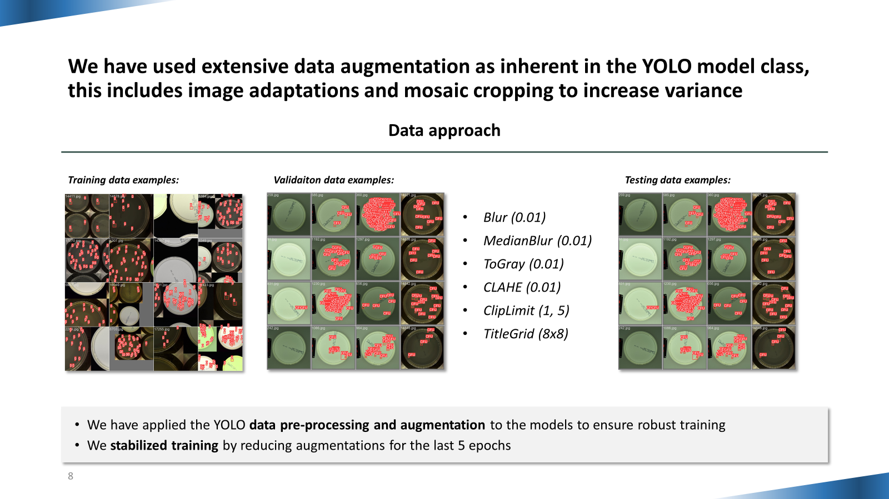
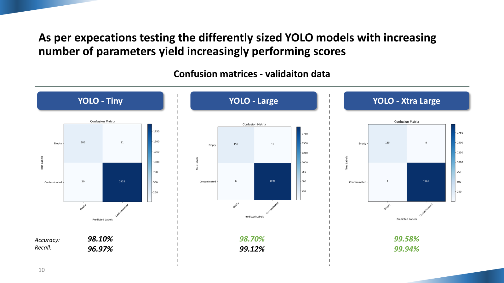
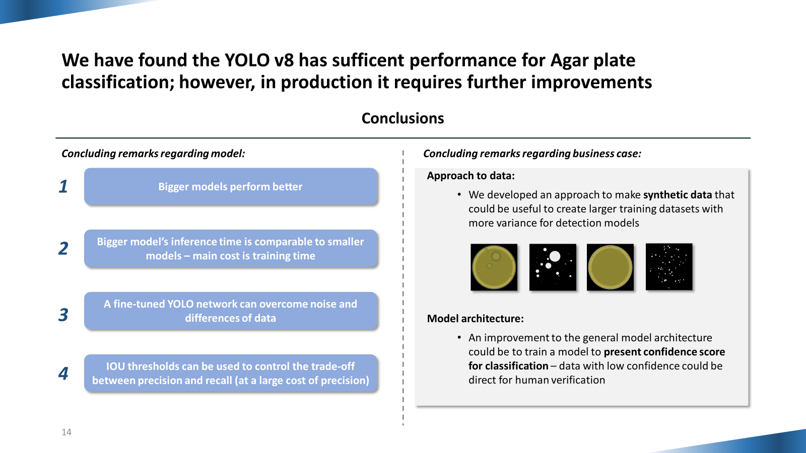

# Agar Bacteria Detection using YOLOv8
## Winning entry of the 2024 Novo Nordisk "Settlers of Agar" hackathon
**Authors: Mikolaj Baranski and Julius Wirbel**

In this repository the winning entry of the competition will be presented alongside the conclusions drawn by the team.

### Competition task:
1. Binary task - detect contaminated agar plate
2. Detection task - count the number of bacterial colonies on the agar plate

### Context:
Agar plates, commonly used in the biomedical industry, must contain only specific specimens to ensure unbiased results. However, contamination often occurs, leading to unwanted bacterial growth. In industrial settings, where hundreds or even thousands of plates need processing quickly, automated methods for detecting bacterial contamination are essential for maintaining both speed and accuracy.

### Dataset:
The competition and task was based on the publicaly available [Annotated Germs for Automated Recognition (AGAR)](https://agar.neurosys.com/) dataset.

### Our approach:

Our approach to the task included fine-tuning computer vision models in various configuration and training pipelines. Initially a DETR model was tested alongside the YOLOv8; however, due to better performance and compatibility the YOLOv8 was refined in the process of the competition. The YOLO's training pipeline was refined to suit the data and conditions of the training. This included extensive setting for image augmentation to allow for broader learning of the model.

### Results:

The trained YOLOv8 models have achieved a very high accuracy within the competiton's validation dataset. The best model achieved an accuracy and recall above 99.5% in the binary classification task. In the detection task the MSLE achieved by the best performing model was only 1.5%.

The results on the external test dataset were very similar with a 99.3% weighted accuracy and recall metric and 2.9% MSLE respectively.

### Conclusions:

