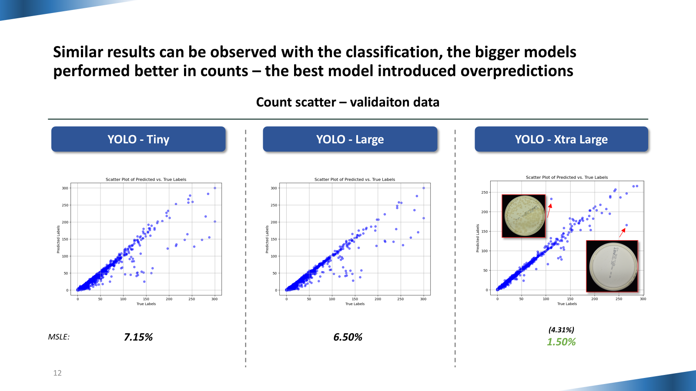

# Agar Bacteria Detection using YOLOv8
## Winning entry of the 2024 Novo Nordisk "Settlers of Agar" hackathon
**Authors: Mikolaj Baranski and Julius Wirbel**

In this repository, the winning entry of the competition will be presented alongside the conclusions drawn by the team.

### Instructions for use:

1. Download the applicable dataset (see Dataset section) and ensure appropriate libraries are installed (see `requirements.txt`).
2. Ensure paths specified in the `utils/config.py` reflect the data location on your machine.
3. Run the `data_transform.ipynb` notebook. This will reorganize the data to fit the format required for training a YOLOv8 model. The train/val split of the data can be adapted in the config file.
4. Ensure paths specified in the `training_instructions.yaml` reflect the settings from `utils/config.py` and the location of files on your machine.
5. Run the `train.ipynb` notebook. Training runs will be saved in the `runs` folder. Training parameters are pre-set for optimal training but can be adapted in the config file (or directly in the notebook). The training code will save the last and the best-performing models (the best model is defined by performance on the validation dataset).

*Note: The code is set up with the assumption of using an environment with a Nvidia GPU available. The code can be easily adapted for CPU training; however, this results in very long training times.*

### Competition task:
1. Binary task - detect contaminated agar plate
2. Detection task - count the number of CFUs (Colony Forming Units), i.e., bacterial colonies, on the agar plate

### Context:
Agar plates, commonly used in the biomedical industry, must contain only specific specimens to ensure unbiased results. However, contamination often occurs, leading to unwanted bacterial growth. In industrial settings, where hundreds or even thousands of plates need processing quickly, automated methods for detecting bacterial contamination are essential to maintain speed and accuracy.

### Dataset:
The competition and task were based on the publicly available [Annotated Germs for Automated Recognition (AGAR)](https://agar.neurosys.com/) dataset.

### Our approach:

Our approach to the task included fine-tuning computer vision models in various configuration and training pipelines. Initially, a DETR model was tested alongside the YOLOv8; however, due to better performance and compatibility, the YOLOv8 was refined in the process of the competition. The YOLO's training pipeline was refined to suit the data and conditions of the training. This included an extensive setting for image augmentation to allow for broader learning of the model.

To streamline the process we decided to train a single model that achieved both binary classification and detections/counts of each bacterial colony. This YOLOv8 model was only trained to detect the CFU (Colony Forming Units) of bacteria and contamination using a single class. All other visual aspects of the images were treated as background.

### Results:

The trained YOLOv8 models have achieved a very high accuracy within the competition's validation dataset. The best model achieved an accuracy and recall above 99.5% in the binary classification task. In the detection task, the MSLE achieved by the best-performing model was only 1.5%.

The results on the external test dataset were very similar with a 99.3% weighted accuracy and recall metric and 2.9% MSLE respectively.

### Conclusions:

